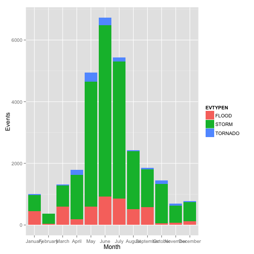
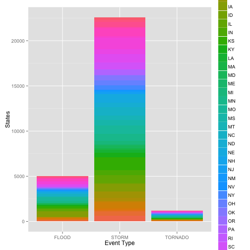

## Storm Watch 

* A Storm Visualizer for the United States
* Allows you to visualize the distribution of Inclement Weather across the country
* Broken Down by State, Event Type, Month, Fatality Count
* Helps you and your organization company plan events

--- .class #id 

## Event Occurances By Month

* Storm Watch allows you to display the breakdown of events by Month
* Enables planning of events by the calendar

 

--- .class #id 

## Event Occurances by State

* Storm Watch allows you to display the breakdown of events by State
* Enables facilities planning based on weather risks involved

 

--- .class #id 

## Table of Event Occurances 

* A regional summary of events
* Because nature of inclement weather is regional


```
## Source: local data frame [4 x 4]
## 
##          REGION FLOOD STORM TORNADO
## 1     Northeast   516  1875      39
## 2         South  1639  9141     483
## 3 North Central  2397  9236     559
## 4          West   444  2334     118
```

--- .class #id 

## Table of Event Occurances 

* A monthly calendar broken down by region


```
## Source: local data frame [12 x 5]
## 
##       MonthF Northeast South North Central West
## 1    January       104   586            87  230
## 2   February        81   155            76   53
## 3      March       197   639           394   84
## 4      April        76   905           639  176
## 5        May       332  2517          1682  409
## 6       June       293  2070          3756  607
## 7       July       819  1522          2593  495
## 8     August       121   837          1164  313
## 9  September       239   610           968   38
## 10   October        49   891           429   70
## 11  November        38   358           124  171
## 12  December        81   173           280  250
```

--- .class #id 
